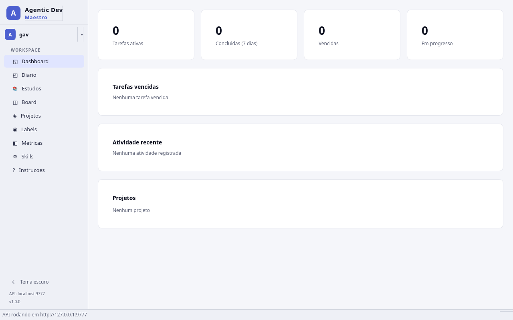
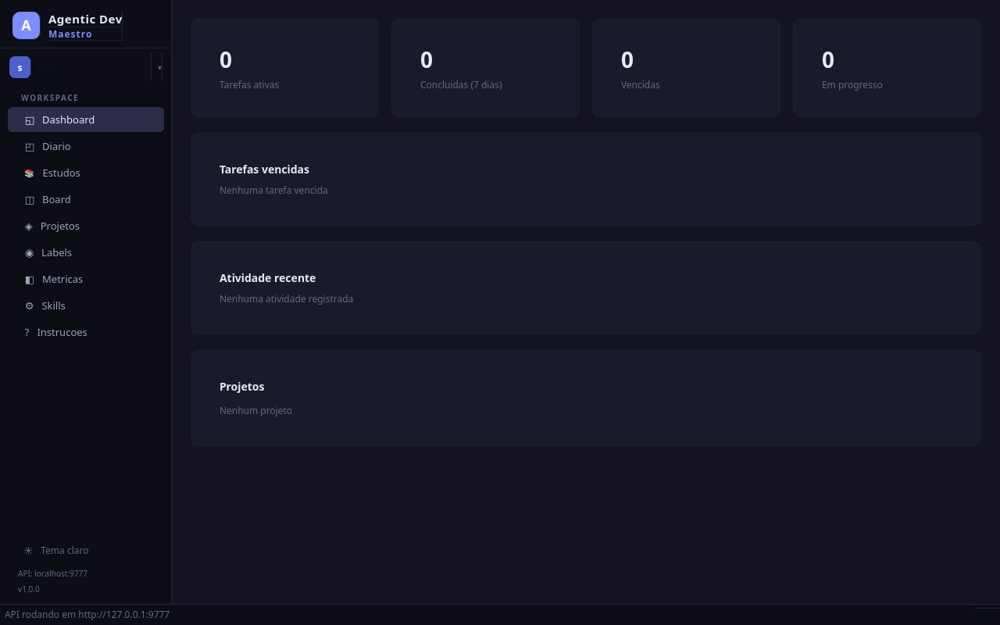
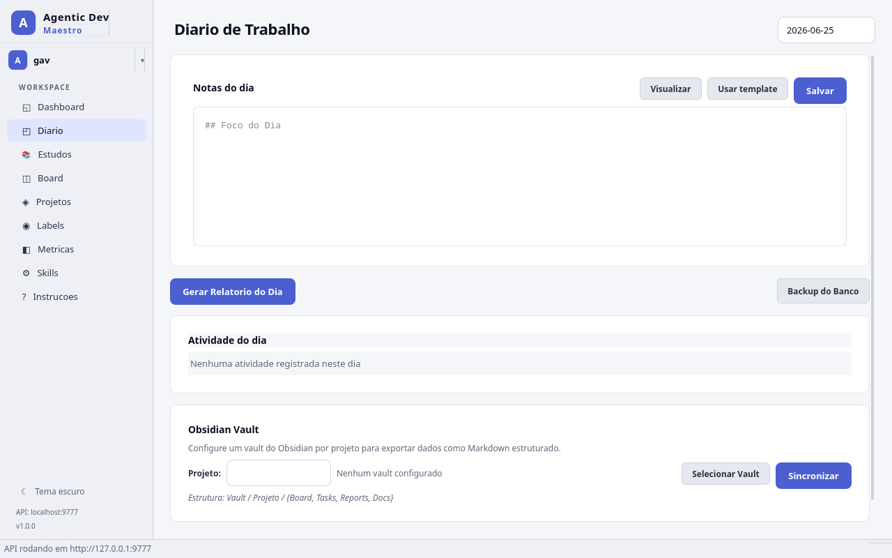
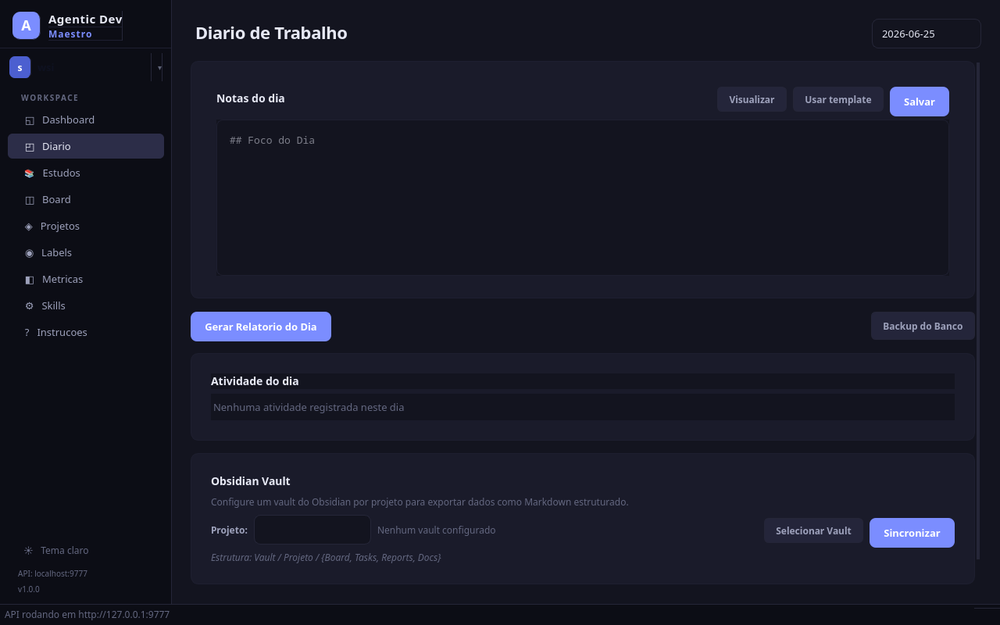
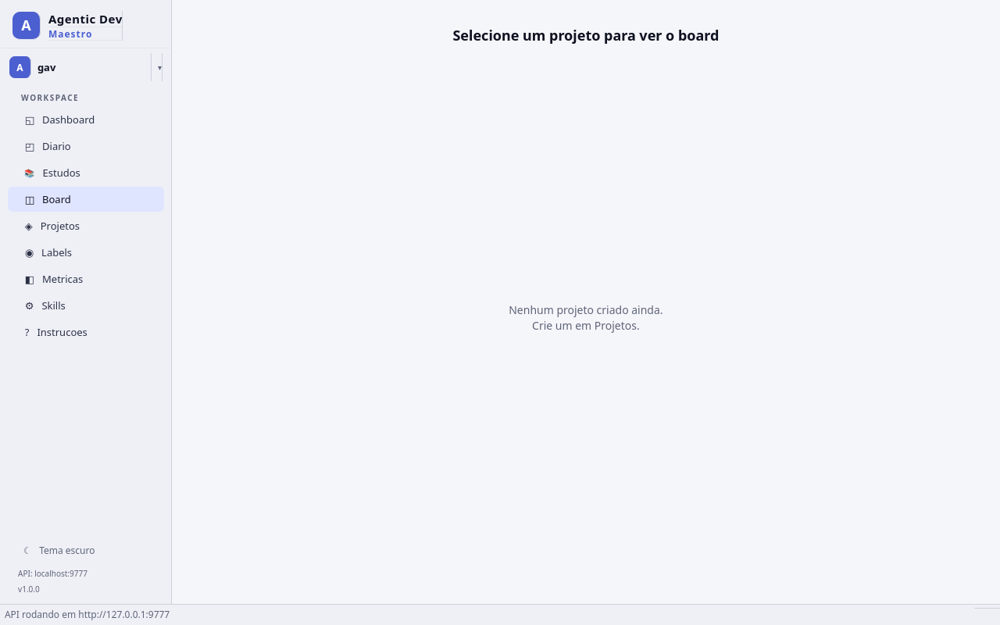
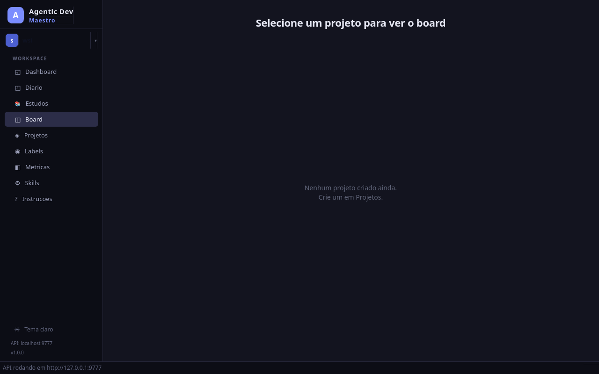
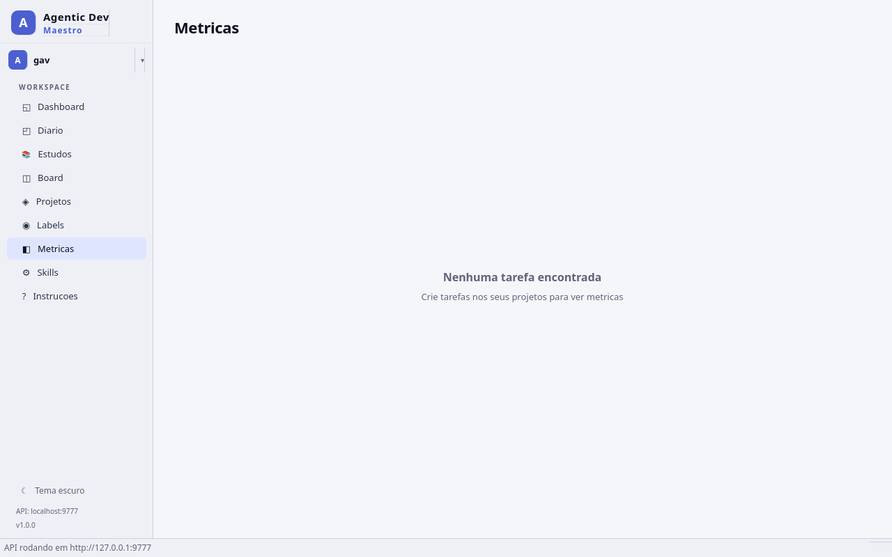
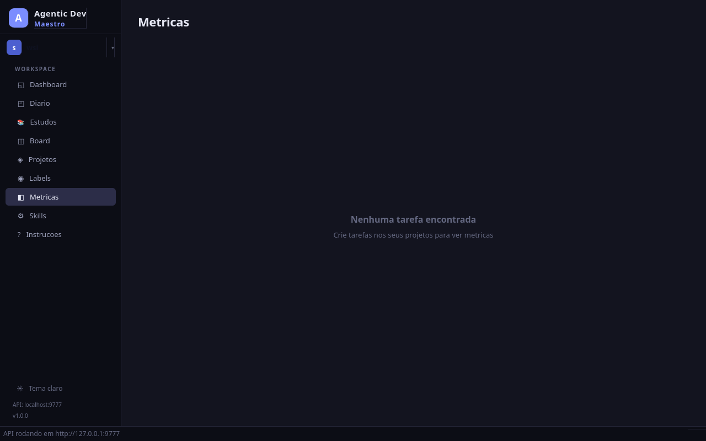

# Agentic Dev Maestro

Aplicacao desktop de gestao de projetos, diario de trabalho e estudos, com API REST embutida para integracao com agentes de IA.



## O que e

O Maestro e uma ferramenta local para desenvolvedores que querem organizar seu trabalho diario, gerenciar tarefas em kanban, acompanhar estudos e integrar agentes de IA no fluxo de desenvolvimento. Tudo roda localmente — sem servidor externo, sem conta, sem dependencia de internet.

### Principais diferenciais

- **Tudo local**: dados em SQLite, GUI desktop nativa, sem cloud
- **API para agentes**: agentes de IA criam tarefas, movem no board, registram code reviews e geram relatorios — tudo via REST
- **Skills prontas**: 11 skills instaláveis que ensinam agentes a usar o Maestro
- **Workspaces isolados**: cada workspace tem seu proprio banco, permitindo separar projetos pessoais de profissionais
- **Obsidian sync**: sincroniza notas diarias e tarefas com seu vault do Obsidian
- **Pomodoro integrado**: timer na sidebar para sessoes de foco

## Inicio Rapido

```bash
cd local-client
./install.sh    # cria venv + instala dependencias + valida
./run.sh        # executa a aplicacao
```

Ou manualmente:

```bash
cd local-client
python3 -m venv .venv
source .venv/bin/activate
pip install -e .
python -m maestro_local
```

A aplicacao abre com:
- **GUI desktop** — interface completa com 9 telas (atalhos Alt+1 a Alt+9)
- **API REST** — `http://127.0.0.1:9777/api` para agentes de IA

### Porta customizada

```bash
./run.sh --port 8888
```

## Funcionalidades

### Meu Dia (home)
Tela principal com notas diarias em markdown, template pre-configurado, geracao de relatorio automatico com resumo de atividades, e sincronizacao com Obsidian vault. Inclui dica de prompt para que agentes de IA gerem o resumo via skill.

### Dashboard
Visao geral com cards de resumo (tarefas ativas, concluidas, vencidas, em progresso), lista de tarefas vencidas clicaveis, atividade recente com timeline, e progresso por projeto.

### Board Kanban
Board com drag-and-drop, colunas customizaveis por projeto, filtros por tipo/prioridade/responsavel, botao quick-move para avancar tarefas, WIP limits e indicador de code review obrigatorio.

### Projetos
Criar e gerenciar projetos com chave unica (ex: DEMO). Cada projeto tem suas colunas de board, tarefas, labels e metricas proprias.

### Labels
Criar labels com cores da paleta, aplicar em tarefas para categorizar e filtrar. Labels sao compartilhadas entre projetos do mesmo workspace.

### Metricas
Dashboard com total de tarefas, concluidas (7 e 30 dias), lead time medio, cycle time, throughput semanal com grafico de barras, e breakdown por tipo, prioridade e projeto.

### Estudos
Planos de estudo com roadmap visual, categorias (Linguagem, Framework, Certificacao, Conceito, Curso, Livro), topicos ponderados, sessoes com tracking de horas e nivel de confianca (1-5).

### Skills
Biblioteca de 11 skills para agentes de IA. Cada skill e um arquivo SKILL.md que pode ser instalado no diretorio `.claude/skills/` do projeto. Botao "Instalar todas" para setup rapido.

### Instrucoes
Guia de uso da aplicacao com explicacoes de cada tela e fluxo.

### Recursos gerais
- Tema dark/light com toggle na sidebar
- Pomodoro timer (25 min) na sidebar
- Busca global de tarefas (Ctrl+K)
- Workspaces isolados com bancos separados, emojis e cores customizaveis
- Backup do banco de dados
- Auto-sync com Obsidian vault por workspace (a cada 5 min)
- Vault configuravel por workspace e projeto

## API REST para agentes

A API roda em `http://127.0.0.1:9777/api` sem autenticacao. Endpoints principais:

| Recurso | Endpoints |
|---|---|
| Health | `GET /api/health` |
| Projetos | `POST/GET /api/projects`, `GET /api/projects/metrics` |
| Tarefas | `POST/GET /api/tasks`, `GET/PATCH/DELETE /api/tasks/{code}`, `POST /api/tasks/{code}/move` |
| Checklist | `POST /api/tasks/{code}/checklist`, `PATCH/DELETE /api/tasks/checklist/{id}` |
| Labels | `POST/GET /api/labels`, `POST/DELETE /api/labels/{id}/tasks/{task_id}` |
| Comentarios | `GET/POST /api/comments`, `PATCH/DELETE /api/comments/{id}` |
| Diario | `GET/POST /api/daily/{date}`, `PATCH /api/daily/{date}/report` |
| Estudos | `POST/GET /api/study/plans`, `PATCH/DELETE /api/study/plans/{id}` |
| Atividade | `GET /api/activity` |

## Skills para agentes de IA

| Skill | O que faz |
|---|---|
| `maestro-run` | Iniciar a aplicacao (GUI + API) |
| `maestro-api-agent` | Ensina o agente a usar a API REST |
| `maestro-task-workflow` | Fluxo completo: pegar task, implementar, mover, documentar |
| `maestro-project-setup` | Criar projeto com colunas e labels padrao |
| `maestro-sprint-planning` | Planejar sprint com estimativas e priorizacao |
| `maestro-code-review-log` | Registrar code reviews como comentarios |
| `maestro-bug-triage` | Triagem de bugs com prioridade e reproducao |
| `maestro-daily-standup` | Gerar relatorio de standup automatico |
| `maestro-tech-debt-tracker` | Registrar e priorizar divida tecnica |
| `maestro-documentation-writer` | Gerar documentacao a partir do codigo |
| `maestro-daily-report` | Relatorio diario com notas, atividade e resumo |

## Screenshots

| Tema Claro | Tema Escuro |
|---|---|
|  |  |
|  |  |
|  |  |
|  |  |

## Estrutura do projeto

```
agentic-dev-maestro/
├── local-client/              # App principal (Python/PySide6)
│   ├── maestro_local/         # Codigo fonte
│   │   ├── gui/views/         # 9 telas da interface
│   │   ├── api/               # FastAPI endpoints
│   │   ├── db/                # SQLAlchemy models + SQLite
│   │   └── skills/            # Catalogo de 11 skills
│   ├── install.sh             # Script de instalacao
│   ├── run.sh                 # Script de execucao
│   ├── pyproject.toml         # Dependencias Python
│   └── docs/screenshots/      # Screenshots
│
├── web-client/                # Cliente web (NestJS + Angular) — em desenvolvimento
├── mcp/                       # Servidor MCP para integracao
├── docs/                      # Documentacao de arquitetura
├── CLAUDE.md                  # Guia para agentes de IA
└── README.md
```

## Dados

Os dados ficam em `~/.maestro-local/`:

```
~/.maestro-local/
├── config.json                # Configuracoes (workspaces, vault paths, tema)
└── workspaces/
    ├── default/
    │   └── maestro.db         # Banco SQLite do workspace padrao
    └── {workspace-id}/
        └── maestro.db         # Banco SQLite de cada workspace
```

## Requisitos

- Python 3.10+
- Sistema operacional: Linux, macOS ou Windows
- Qt 6 (instalado automaticamente com PySide6)

## Licenca

MIT
