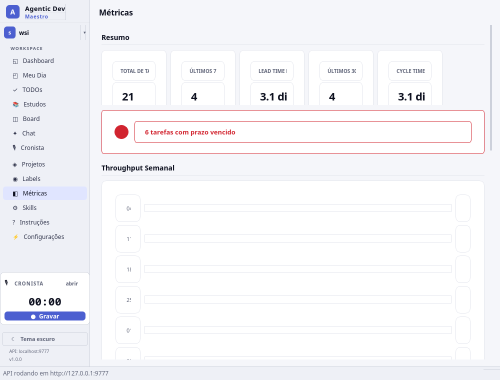

# Agentic Dev Maestro

Aplicação desktop de gestão de projetos, diário de trabalho e estudos, com API REST embutida para integração com agentes de IA.


## O que é

O Maestro é uma ferramenta local para desenvolvedores que querem organizar seu trabalho diário, gerenciar tarefas em kanban, acompanhar estudos e integrar agentes de IA no fluxo de desenvolvimento. Tudo roda localmente — sem servidor externo, sem conta, sem dependência de internet.

### Principais diferenciais

- **Tudo local**: dados em SQLite, GUI desktop nativa, sem cloud
- **API para agentes**: agentes de IA criam tarefas, movem no board, registram code reviews e geram relatórios — tudo via REST
- **Skills prontas**: 11 skills instaláveis que ensinam agentes a usar o Maestro
- **Workspaces isolados**: cada workspace tem seu próprio banco, permitindo separar projetos pessoais de profissionais
- **Obsidian sync**: sincroniza notas diárias e tarefas com seu vault do Obsidian
- **Pomodoro integrado**: timer na sidebar para sessões de foco

## Início Rápido

```bash
cd local-client
./install.sh    # cria venv + instala dependências + valida
./run.sh        # executa a aplicação
```

Ou manualmente:

```bash
cd local-client
python3 -m venv .venv
source .venv/bin/activate
pip install -e .
python -m maestro_local
```

A aplicação abre com:
- **GUI desktop** — interface completa com 9 telas (atalhos Alt+1 a Alt+9)
- **API REST** — `http://127.0.0.1:9777/api` para agentes de IA

### Porta customizada

```bash
./run.sh --port 8888
```

## Funcionalidades

### Meu Dia (home)
Tela principal com notas diárias em markdown, template pre-configurado, geração de relatório automático com resumo de atividades, e sincronização com Obsidian vault. Inclui dica de prompt para que agentes de IA gerem o resumo via skill.

### Dashboard
Visão geral com cards de resumo (tarefas ativas, concluídas, vencidas, em progresso), lista de tarefas vencidas clicáveis, atividade recente com timeline, e progresso por projeto.

### Board Kanban
Board com drag-and-drop, colunas customizáveis por projeto, filtros por tipo/prioridade/responsável, botão quick-move para avançar tarefas, WIP limits e indicador de code review obrigatório.

### Projetos
Criar e gerenciar projetos com chave única (ex: DEMO). Cada projeto tem suas colunas de board, tarefas, labels e métricas próprias.

### Labels
Criar labels com cores da paleta, aplicar em tarefas para categorizar e filtrar. Labels são compartilhadas entre projetos do mesmo workspace.

### Métricas
Dashboard com total de tarefas, concluídas (7 e 30 dias), lead time médio, cycle time, throughput semanal com gráfico de barras, e breakdown por tipo, prioridade e projeto.

### Estudos
Planos de estudo com roadmap visual, categorias (Linguagem, Framework, Certificação, Conceito, Curso, Livro), tópicos ponderados, sessões com tracking de horas e nível de confiança (1-5).

### Skills
Biblioteca de 11 skills para agentes de IA. Cada skill é um arquivo SKILL.md que pode ser instalado no diretório `.claude/skills/` do projeto. Botão "Instalar todas" para setup rápido.

### Instruções
Guia de uso da aplicação com explicações de cada tela e fluxo.

### Recursos gerais
- Tema dark/light com toggle na sidebar
- Pomodoro timer (25 min) na sidebar
- Busca global de tarefas (Ctrl+K)
- Workspaces isolados com bancos separados, emojis e cores customizáveis
- Backup do banco de dados
- Auto-sync com Obsidian vault por workspace (a cada 5 min)
- Vault configurável por workspace e projeto

## API REST para agentes

A API roda em `http://127.0.0.1:9777/api` sem autenticação. Endpoints principais:

| Recurso | Endpoints |
|---|---|
| Health | `GET /api/health` |
| Projetos | `POST/GET /api/projects`, `GET /api/projects/metrics` |
| Tarefas | `POST/GET /api/tasks`, `GET/PATCH/DELETE /api/tasks/{code}`, `POST /api/tasks/{code}/move` |
| Checklist | `POST /api/tasks/{code}/checklist`, `PATCH/DELETE /api/tasks/checklist/{id}` |
| Labels | `POST/GET /api/labels`, `POST/DELETE /api/labels/{id}/tasks/{task_id}` |
| Comentários | `GET/POST /api/comments`, `PATCH/DELETE /api/comments/{id}` |
| Diario | `GET/POST /api/daily/{date}`, `PATCH /api/daily/{date}/report` |
| Estudos | `POST/GET /api/study/plans`, `PATCH/DELETE /api/study/plans/{id}` |
| Atividade | `GET /api/activity` |

## Skills para agentes de IA

| Skill | O que faz |
|---|---|
| `maestro-run` | Iniciar a aplicação (GUI + API) |
| `maestro-api-agent` | Ensina o agente a usar a API REST |
| `maestro-task-workflow` | Fluxo completo: pegar task, implementar, mover, documentar |
| `maestro-project-setup` | Criar projeto com colunas e labels padrão |
| `maestro-sprint-planning` | Planejar sprint com estimativas e priorização |
| `maestro-code-review-log` | Registrar code reviews como comentários |
| `maestro-bug-triage` | Triagem de bugs com prioridade e reprodução |
| `maestro-daily-standup` | Gerar relatório de standup automático |
| `maestro-tech-debt-tracker` | Registrar e priorizar dívida técnica |
| `maestro-documentation-writer` | Gerar documentação a partir do código |
| `maestro-daily-report` | Relatório diário com notas, atividade e resumo |

## Screenshots





## Estrutura do projeto

```
agentic-dev-maestro/
├── local-client/              # App principal (Python/PySide6)
│   ├── maestro_local/         # Código fonte
│   │   ├── gui/views/         # 9 telas da interface
│   │   ├── api/               # FastAPI endpoints
│   │   ├── db/                # SQLAlchemy models + SQLite
│   │   └── skills/            # Catálogo de 11 skills
│   ├── install.sh             # Script de instalação
│   ├── run.sh                 # Script de execução
│   ├── pyproject.toml         # Dependências Python
│   └── docs/screenshots/      # Screenshots
│
├── web-client/                # Cliente web (NestJS + Angular) — em desenvolvimento
├── mcp/                       # Servidor MCP para integração
├── docs/                      # Documentação de arquitetura
├── CLAUDE.md                  # Guia para agentes de IA
└── README.md
```

## Dados

Os dados ficam em `~/.maestro-local/`:

```
~/.maestro-local/
├── config.json                # Configurações (workspaces, vault paths, tema)
└── workspaces/
    ├── default/
    │   └── maestro.db         # Banco SQLite do workspace padrão
    └── {workspace-id}/
        └── maestro.db         # Banco SQLite de cada workspace
```

## Requisitos

- Python 3.10+
- Sistema operacional: Linux, macOS ou Windows
- Qt 6 (instalado automaticamente com PySide6)

## Licença

Licença Privada. Copyright (c) 2026 WalterSilva5. Todos os direitos reservados. Consulte o arquivo [LICENSE](LICENSE) para detalhes.
