> 🇬🇧 [English version](README.md)

# Agentic Dev Maestro

Aplicação desktop de gestão de projetos, diário de trabalho e estudos, com API REST embutida para integração com agentes de IA.

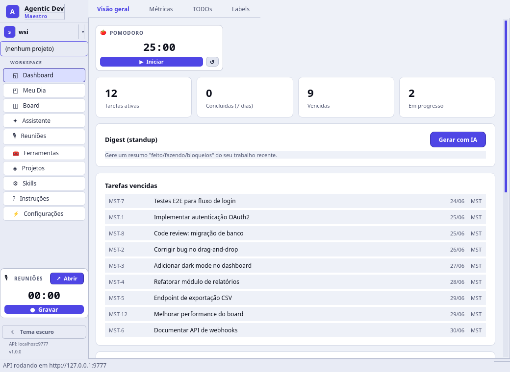

## O que é

O Maestro é uma ferramenta local para desenvolvedores que querem organizar seu trabalho diário, gerenciar tarefas em kanban, acompanhar estudos e integrar agentes de IA no fluxo de desenvolvimento. Tudo roda localmente — sem servidor externo, sem conta, sem dependência de internet.

### Principais diferenciais

- **Tudo local**: dados em SQLite, GUI desktop nativa, sem cloud
- **Assistente**: agente de IA interno (LangGraph) com provedor configurável (LM Studio, opencode) que age sobre o board
- **Cronista**: grava reuniões/estudos, transcreve local com Whisper e resume com IA (ex-projeto wsi-cronista integrado)
- **API para agentes**: agentes de IA criam tarefas, movem no board, registram code reviews e geram relatórios — tudo via REST
- **Skills prontas**: 12 skills instaláveis que ensinam agentes a usar o Maestro
- **Workspaces isolados**: cada workspace tem seu próprio banco, permitindo separar projetos pessoais de profissionais
- **Obsidian sync**: sincroniza notas diárias e tarefas com seu vault do Obsidian
- **Pomodoro integrado**: timer no Dashboard para sessões de foco

## Instalação com agente de IA

Você pode pedir a um agente de IA (Claude Code, Cursor, etc.) para instalar o Maestro de ponta a ponta. Esta seção tem tudo que o agente precisa: os pré-requisitos a instalar e os passos exatos. Um prompt de uma linha para começar:

> Leia a seção "Instalação com agente de IA" do README em https://github.com/WalterSilva5/agentic-dev-maestro.git, instale os pré-requisitos para o meu SO, clone o repositório, execute o `local-client/install.sh`, crie um atalho na área de trabalho para o `local-client/run.sh` e me explique como usar a aplicação.

### Pré-requisitos que o agente deve instalar

Instale estes **pacotes de sistema** primeiro. As bibliotecas Python são tratadas pelo `install.sh` dentro de um virtualenv — **não** as instale globalmente.

| Dependência | Para quê | Obrigatório |
| --- | --- | --- |
| **git** | clonar o repositório | sim |
| **Python 3.10+** (com o módulo `venv`) | executa a aplicação | sim |
| **pulseaudio-utils** (`parec` / `pactl`) | captura do áudio do sistema em Reuniões / Transcrições | Linux, para reuniões |
| **Node.js 18+ e npm** | builda a web UI opcional servida pela API | opcional |

Instalação por SO:

```bash
# Debian / Ubuntu
sudo apt update && sudo apt install -y git python3 python3-venv python3-pip pulseaudio-utils nodejs npm

# Arch / Manjaro
sudo pacman -S --needed git python nodejs npm libpulse

# Fedora
sudo dnf install -y git python3 python3-pip nodejs npm pulseaudio-utils

# macOS (Homebrew)
brew install git python node

# Windows: use o WSL2 (Ubuntu) e siga a linha do Debian/Ubuntu acima
```

> **Reuniões / Transcrições** capturam o áudio do sistema via `parec` do PulseAudio — recurso **Linux**. Sem o `pulseaudio-utils` o resto da aplicação continua funcionando; só a gravação fica desabilitada.
>
> **Recursos de IA** (assistente, copiloto de reunião, contexto por imagem/tela) precisam de um provedor compatível com OpenAI configurado em **Configurações** (ex.: LM Studio local ou um endpoint pago). Ler imagens/capturas de tela como contexto exige um modelo **com visão**.

### Passos

O agente deve:

1. Instalar os pré-requisitos acima para o SO do usuário.
2. Clonar o repositório: `git clone https://github.com/WalterSilva5/agentic-dev-maestro.git`
3. Rodar o instalador: `cd agentic-dev-maestro/local-client && ./install.sh` — cria um `.venv`, instala as dependências Python (`pip install -e .`) e builda a web UI quando o `npm` está presente.
4. Executar: `./run.sh` (opcionalmente `--port 8888`). A GUI desktop abre e a API + web UI ficam em `http://127.0.0.1:9777/`.
5. *(Opcional)* Criar um atalho `.desktop` na área de trabalho apontando para `local-client/run.sh`.
6. Abrir **Configurações** e configurar um provedor de IA (base URL, modelo, API key) para habilitar o assistente e o copiloto de reunião.
7. Na aba **Skills**, instalar as skills no diretório do projeto do usuário — elas ensinam o agente a usar a API do Maestro para criar tarefas, documentar progresso e gerar relatórios.

## Funcionalidades

### Meu Dia (home)
Tela principal com notas diárias em markdown, template pre-configurado, geração de relatório automático com resumo de atividades, e sincronização com Obsidian vault. Date picker com calendário popup para navegar entre dias. Inclui dica de prompt para que agentes de IA gerem o resumo via skill.

### Dashboard
Hub central organizado em abas: **Visão geral** (Pomodoro, cards de resumo, tarefas vencidas, atividade recente e progresso por projeto), **Métricas**, **TODOs** e **Labels**.

### Board Kanban
Board com drag-and-drop, colunas customizáveis por projeto, filtros por tipo/prioridade/responsável, botão quick-move para avançar tarefas, WIP limits e indicador de code review obrigatório. Agentes sempre criam tarefas de revisão (`requiresHuman: true`) para o desenvolvedor validar alterações.

### Assistente
Assistente de IA interno que roda com seu próprio provedor (LM Studio local, opencode ou qualquer API compatível com OpenAI). Ele lê o board, sugere prioridades, solicita revisões de tarefas, cria TODOs e comenta tarefas — tudo dentro da aplicação. Construído com LangGraph e ferramentas internas. Configurável em Configurações → Provedores de IA.

**Coach proativo:** ao longo do dia o agente exibe dicas curtas e acionáveis com base no seu board e TODOs (foco, organização, risco ou uma pausa saudável) num card não intrusivo. Opt-in e configurável em Configurações → Coach proativo (intervalo); também disponível via `GET /api/coach/tip`.

### Transcrições (Reuniões)
Grava reuniões e sessões de estudo (microfone e/ou áudio do sistema via PipeWire/PulseAudio), transcreve localmente com faster-whisper e gera resumos estruturados com IA — reuniões viram pontos-chave/decisões/ações; estudos viram conceitos/exercícios/tópicos relacionados. Recursos específicos de reunião:

- **Modo de preparação** — prepare a reunião antes de começar: escreva a pauta/objetivos e anexe contexto (arquivos, PDFs, imagens ou uma captura de tela; imagens/telas são lidas por um modelo com visão) para o copiloto ao vivo já iniciar sabendo do que se trata.
- **Copiloto ao vivo** — transcreve e extrai plano, dicas, ações, decisões e perguntas & respostas em tempo real (liga/desliga a qualquer momento), além do campo "perguntar à reunião".
- **Ver um monitor** — deixe o assistente ver periodicamente uma tela escolhida (lida por um modelo com visão) para ajudar a resolver tarefas na tela; ativável/desativável durante a reunião.
- **Importar de transcrições externas** — crie uma reunião a partir de uma exportação do Meet/Teams (texto, VTT/SRT, PDF, DOCX) e rode a mesma análise.
- **Destino workspace/projeto** — troque o workspace/projeto de destino pela própria tela da reunião.
- **Histórico** — pesquisável; excluir, arquivar e reordenar gravações; reuniões nomeadas com prefixo de data/hora.
- Atalho global **Ctrl+Shift+R** e botão para salvar o resumo no Meu Dia.

Funcionalidades migradas do projeto wsi-cronista.

### Projetos
Criar e gerenciar projetos com chave única (ex: DEMO). Cada projeto tem suas colunas de board, tarefas, labels e métricas próprias.

### Labels
Criar labels com cores da paleta, aplicar em tarefas para categorizar e filtrar. Labels são compartilhadas entre projetos do mesmo workspace.

### Métricas
Dashboard com total de tarefas, concluídas (7 e 30 dias), lead time médio, cycle time, throughput semanal com gráfico de barras, e breakdown por tipo, prioridade e projeto.

### Estudos
Planos de estudo com roadmap visual, categorias (Linguagem, Framework, Certificação, Conceito, Curso, Livro), tópicos ponderados, sessões com tracking de horas e nível de confiança (1-5).

### Skills
Biblioteca de 12 skills para agentes de IA. Cada skill é um arquivo SKILL.md que pode ser instalado no diretório `.claude/skills/` do projeto. Botão "Instalar todas" para setup rápido.

### Instruções
Guia de uso da aplicação com 12 seções, incluindo explicações de cada tela, fluxo de trabalho, o papel dos agentes e tarefas de revisão.

### Configurações
Tela de configurações gerais com:
- **Provedores de IA**: cadastrar/selecionar provedores compatíveis com OpenAI (LM Studio, Ollama, OpenAI, OpenRouter, Groq, DeepSeek, Mistral, Gemini, Together, opencode), com teste de conexão. Usado pelo Assistente
- **Pomodoro**: duração da sessão configurável (1-120 min)
- **Notificações push**: notificações periódicas na área de trabalho com mensagem personalizada, intervalo configurável e ativação/desativação

### Recursos gerais
- Tema dark/light com toggle na sidebar
- Pomodoro timer configurável no Dashboard
- Acesso rápido às Transcrições na sidebar (gravar em 1 clique)
- Notificações push periódicas com mensagem customizada
- Busca global de tarefas (Ctrl+K)
- Workspaces isolados com bancos separados, emojis e cores customizáveis
- Backup do banco de dados
- Auto-sync com Obsidian vault por workspace (a cada 5 min)
- Vault configurável por workspace e projeto

## Início Rápido (manual)

```bash
cd local-client
./install.sh    # cria venv + instala dependências + valida
./run.sh        # executa a aplicação
```

Ou:

```bash
cd local-client
python3 -m venv .venv
source .venv/bin/activate
pip install -e .
python -m maestro_local
```

A aplicação abre com:
- **GUI desktop** — interface completa com 10 telas no menu (Métricas, TODOs e Labels viraram abas do Dashboard)
- **API REST** — `http://127.0.0.1:9777/api` para agentes de IA

### Porta customizada

```bash
./run.sh --port 8888
```

### Shell de desktop (experimental — rota web)

Primeiro passo da migração de front-end para a rota web (ver
[docs/planos/migracao-frontend-responsivo.ptbr.md](docs/planos/migracao-frontend-responsivo.ptbr.md)):
roda a web UI React responsiva numa janela nativa via pywebview, servida pela
mesma API/daemon local. A GUI Qt continua sendo o padrão; isto é opt-in.

```bash
cd local-client
pip install -e '.[shell]'   # instala o pywebview
maestro-shell               # ou: python -m maestro_local.desktop_shell [--port 9777]
```

## API REST para agentes

A API roda em `http://127.0.0.1:9777/api` sem autenticação. Endpoints principais:

| Recurso | Endpoints |
|---|---|
| Health | `GET /api/health` |
| Projetos | `POST/GET /api/projects`, `GET /api/projects/metrics` |
| Tarefas | `POST/GET /api/tasks`, `GET/PATCH/DELETE /api/tasks/{code}`, `POST /api/tasks/{code}/move` |
| Checklist | `POST /api/tasks/{code}/checklist`, `PATCH/DELETE /api/tasks/checklist/{id}` |
| Labels | `POST/GET /api/labels`, `POST/DELETE /api/labels/{id}/tasks/{task_id}` |
| Comentários | `GET/POST /api/comments`, `PATCH/DELETE /api/comments/{id}` |
| Diario | `GET/POST /api/daily/{date}`, `PATCH /api/daily/{date}/report` |
| TODOs | `GET/POST /api/todos`, `PATCH/DELETE /api/todos/{id}` |
| Estudos | `POST/GET /api/study/plans`, `PATCH/DELETE /api/study/plans/{id}` |
| Histórico | `GET /api/tasks/{code}/history` |
| Changelog | `GET /api/projects/{project_id}/changelog?days=7` |
| Atividade | `GET /api/activity` |

## Skills para agentes de IA

| Skill | O que faz |
|---|---|
| `maestro-run` | Iniciar a aplicação (GUI + API) |
| `maestro-api-agent` | Ensina o agente a usar a API REST |
| `maestro-task-workflow` | Fluxo completo: pegar task, implementar, mover, documentar |
| `maestro-project-setup` | Criar projeto com colunas e labels padrão |
| `maestro-sprint-planning` | Planejar sprint com estimativas e priorização |
| `maestro-code-review-log` | Registrar code reviews como comentários |
| `maestro-bug-triage` | Triagem de bugs com prioridade e reprodução |
| `maestro-daily-standup` | Gerar relatório de standup automático |
| `maestro-tech-debt-tracker` | Registrar e priorizar dívida técnica |
| `maestro-documentation-writer` | Gerar documentação a partir do código |
| `maestro-daily-report` | Relatório diário com notas, atividade e resumo (suporta modo parcial) |
| `maestro-context-loader` | Carregar contexto completo do workspace para retomar trabalho de onde parou |

## Screenshots


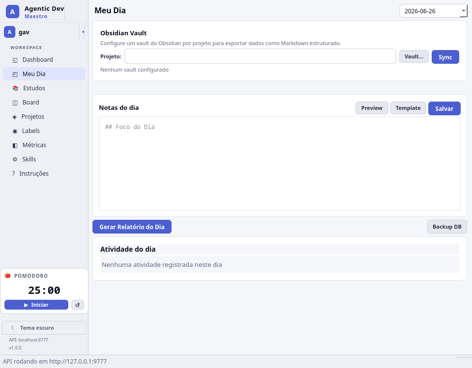
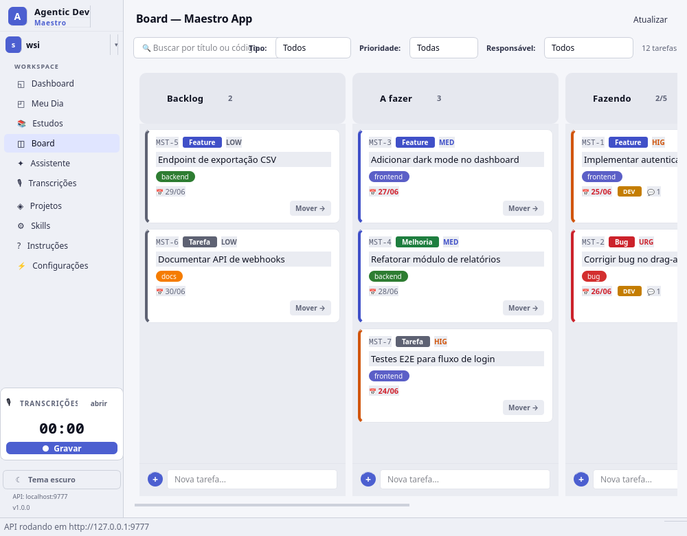
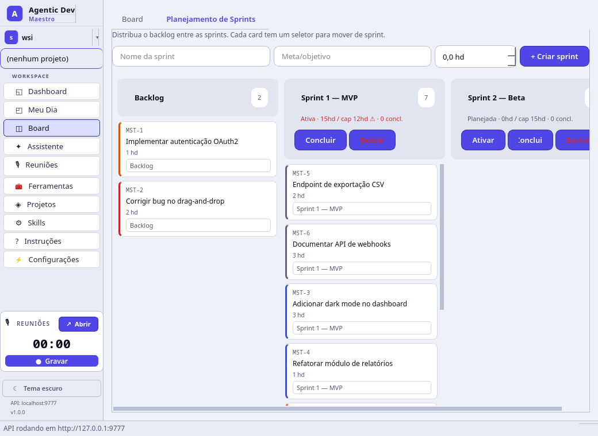
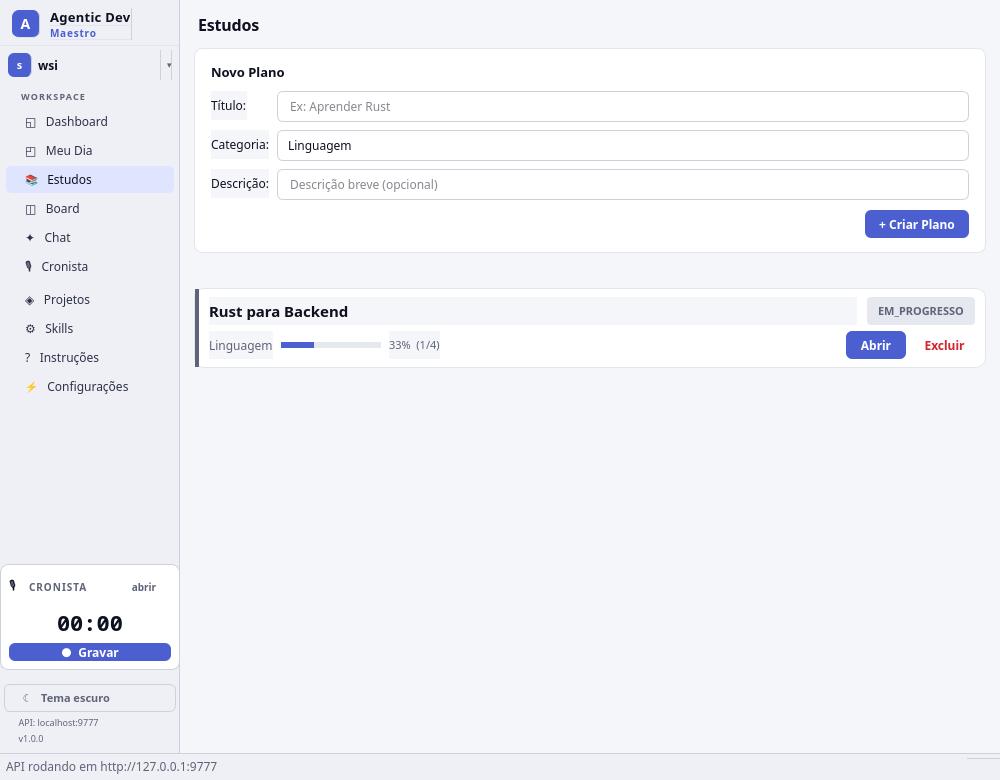
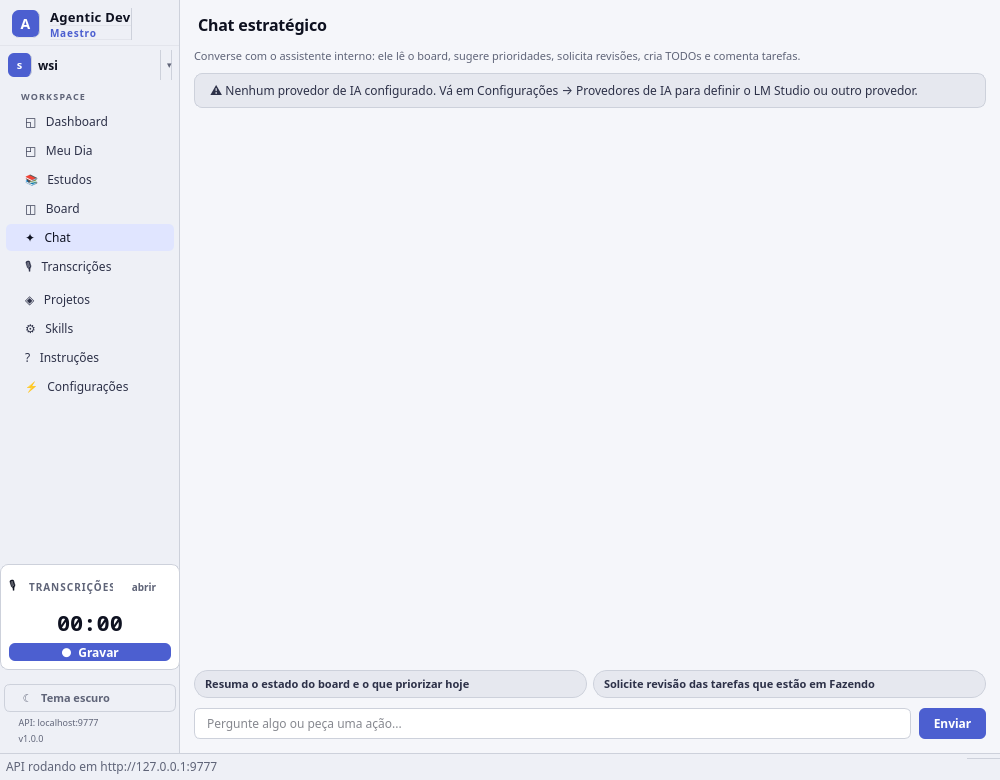
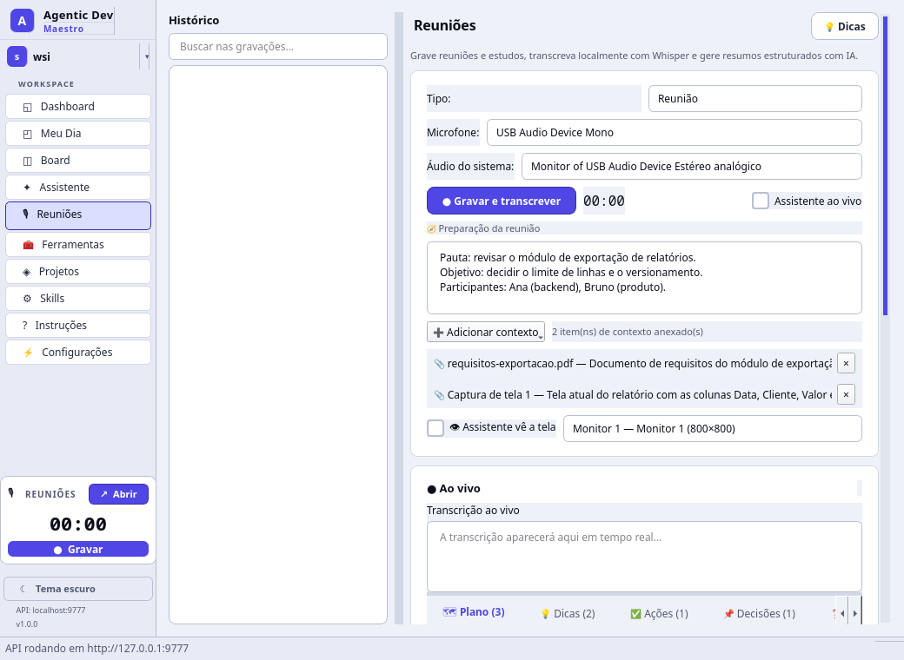
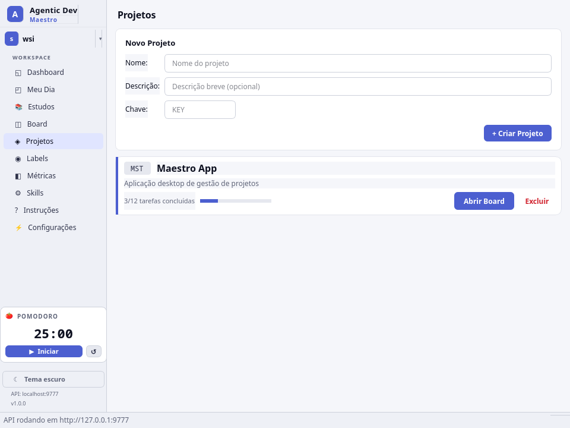
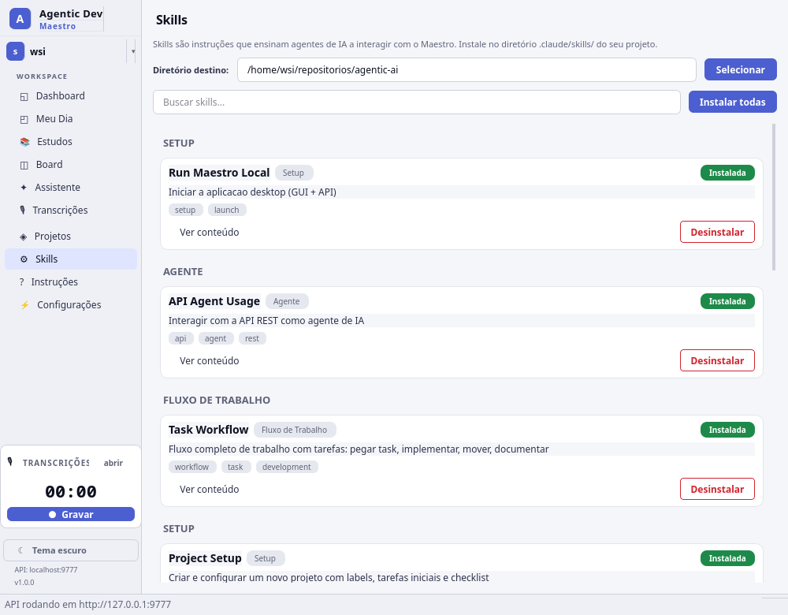
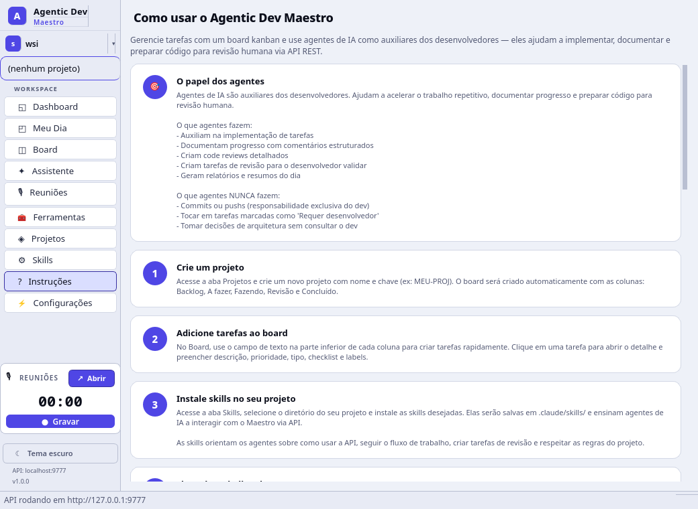
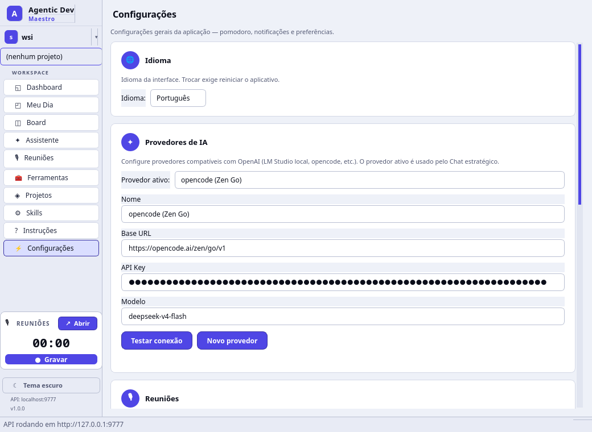

## Estrutura do projeto

```
agentic-dev-maestro/
├── local-client/              # App principal (Python/PySide6)
│   ├── maestro_local/         # Código fonte
│   │   ├── gui/views/         # telas da interface (Dashboard com abas)
│   │   ├── api/               # FastAPI endpoints
│   │   ├── db/                # SQLAlchemy models + SQLite
│   │   └── skills/            # Catálogo de 12 skills
│   ├── install.sh             # Script de instalação
│   ├── run.sh                 # Script de execução
│   ├── pyproject.toml         # Dependências Python
│   └── docs/screenshots/      # Screenshots
│
├── web-client/                # Cliente web (NestJS + Angular) — em desenvolvimento
├── mcp/                       # Servidor MCP para integração
├── docs/                      # Documentação de arquitetura
├── CLAUDE.md                  # Guia para agentes de IA
└── README.md
```

## Dados

Os dados ficam em `~/.maestro-local/`:

```
~/.maestro-local/
├── config.json                # Configurações (workspaces, vault paths, tema)
└── workspaces/
    ├── default/
    │   └── maestro.db         # Banco SQLite do workspace padrão
    └── {workspace-id}/
        └── maestro.db         # Banco SQLite de cada workspace
```

## Requisitos

- Python 3.10+ (com o módulo `venv`)
- git
- Sistema operacional: Linux, macOS ou Windows (Windows via WSL2)
- Qt 6 (instalado automaticamente com PySide6)
- `pulseaudio-utils` (`parec` / `pactl`) — só Linux, para gravação em Reuniões/Transcrições
- Node.js 18+ e npm — opcional, para buildar a web UI
- Provedor de IA compatível com OpenAI — opcional, para habilitar o assistente e o copiloto de reunião (modelo com visão é necessário para ler imagens/telas como contexto)

Veja [Instalação com agente de IA](#instalação-com-agente-de-ia) para os comandos de instalação por SO.

## Licença

Licença Privada. Copyright (c) 2026 WalterSilva5. Todos os direitos reservados. Consulte o arquivo [LICENSE](LICENSE) para detalhes.
