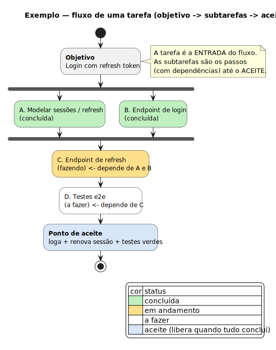

> 🇬🇧 [English version](08-fluxo-de-tarefas.md)

# 08 — Fluxo de tarefas (objetivo → subtarefas → aceite)

A plataforma **exibe cada tarefa como um fluxograma**, não só como uma lista de
subtarefas. A ideia:

> Uma **tarefa** é a *entrada* do fluxo: tem um **objetivo** e um **ponto de
> aceitação** (critério de aceite). Para chegar ao aceite, é preciso concluir os
> **passos** — as **subtarefas** — que podem ter **dependências** entre si.

Exemplo renderizado: [`diagramas/fluxo-tarefa-exemplo.svg`](diagramas/fluxo-tarefa-exemplo.svg)



## O que isso adiciona ao modelo

Detalhe em [doc 02](02-modelo-de-dados.md). Resumo:

- `Task.objective` — o **objetivo** (entrada do fluxo).
- `Task.acceptance` — o **critério de aceite** (ponto de aceitação).
- `TaskDependency` — aresta de **precedência** `blocker → blocked` entre tarefas/
  subtarefas. O conjunto de arestas forma um **DAG** (grafo acíclico).

## Dois níveis de fluxo (mesma mecânica)

1. **Fluxo de uma tarefa** — nós = subtarefas; arestas = dependências entre elas.
   É o caso principal (o exemplo acima).
2. **Fluxo de um projeto** — nós = tarefas; arestas = dependências entre tarefas.
   Mesma estrutura (`TaskDependency`), só muda o nível exibido.

## Como o grafo é montado

Dado uma tarefa e suas subtarefas + dependências, o backend produz um grafo com
dois **nós sintéticos**:

- **Entrada** (`objetivo`) → liga-se às subtarefas **raiz** (sem `blocker`).
- **Aceite** (`acceptance`) ← recebe das subtarefas **folha** (sem `blocked`).

Regras:

- **Sem dependências** → todas as subtarefas são raiz e folha: o fluxo vira
  `entrada → (cada subtarefa em paralelo) → aceite`. Não inventa ordem que não existe.
- **Com dependências** → o layout segue a precedência (sequência, ramificação,
  paralelo + junção), como no exemplo (A‖B → C → D → aceite).
- **DAG obrigatório** → ciclos são rejeitados na criação da aresta (ver validação).

## Estado e cores dos nós

A cor do nó reflete o status (a coluna do kanban onde a subtarefa está):

| Nó | Significado |
|---|---|
| 🟩 concluída | subtarefa numa coluna "concluída" |
| 🟨 em andamento | subtarefa em "fazendo"/"revisão" |
| ⬜ a fazer | ainda não iniciada |
| 🔒 bloqueada | tem `blocker` ainda não concluído (não pode começar) |
| 🟦 aceite | nó terminal; **libera quando todas as subtarefas concluem** |

- **Bloqueio é derivado**, não um status manual: uma subtarefa está bloqueada se
  qualquer dependência (`blocker`) não estiver concluída.
- **Progresso da tarefa** = % de subtarefas concluídas; o nó de aceite indica
  "pronto para aceitar" quando 100% + critérios de aceite atendidos.

## Validação (DAG)

- Ao criar `TaskDependency`, rejeitar se a aresta criar **ciclo** (busca em
  profundidade a partir de `blocked` procurando `blocker`).
- Rejeitar auto-dependência (`blockerId == blockedId`).
- Dependências normalmente ligam subtarefas da **mesma tarefa-pai**; ligar tarefas
  de projetos/empresas diferentes é proibido (mesmo `companyId`).

## Renderização na plataforma

| Onde | Tecnologia | Por quê |
|---|---|---|
| **Dentro do app** (interativo) | **`@swimlane/ngx-graph`** (Angular + dagre) | nós customizados com status/cor, clicáveis, pan/zoom, layout automático do DAG |
| **Export / docs markdown** | **Mermaid** (`flowchart`) | renderiza nativo no GitHub/Obsidian; acompanha a doc exportada da tarefa |
| **Docs estáticas do repo** | PlantUML (como em `docs/diagramas/`) | mantém o padrão dos diagramas de arquitetura |

- **In-app:** `ngx-graph` recebe `{ nodes, edges }` da API e usa template de nó
  próprio (título, código `GAV-42`, assignee, cor por status, cadeado se bloqueada).
  Clicar num nó abre o detalhe da subtarefa; o layout (dagre) é automático.
- **Export:** a API também emite o mesmo grafo como **Mermaid** para embutir na doc
  markdown da tarefa (o artefato que o time recebe). Ex.:

  ```mermaid
  flowchart TD
    OBJ([Objetivo: login com refresh]) --> A[A. Modelar sessões]
    OBJ --> B[B. Endpoint de login]
    A --> C[C. Endpoint de refresh]
    B --> C
    C --> D[D. Testes e2e]
    D --> ACE([Aceite: loga + renova + testes verdes])
  ```

## Interações (app)

- **Clicar nó** → abre o detalhe da subtarefa.
- **Ligar dois nós** (arrastar de um para outro) → cria `TaskDependency` (com
  validação de ciclo); desfazer remove a aresta.
- **Mover subtarefa no kanban** → recolore o nó automaticamente (mesmo estado).
- *(futuro)* destacar **caminho crítico** e subtarefas bloqueando o aceite.

## API (resumo — detalhe no doc 03)

- `GET /tasks/:code/flow` → `{ nodes, edges }` (e `?format=mermaid` → texto Mermaid).
- `POST /tasks/:code/dependencies` `{ blockerCode, blockedCode }` (valida DAG).
- `DELETE /tasks/:code/dependencies/:depId`.
- No `POST /tasks/bulk` (decompose), o agente pode já enviar `dependsOn` em cada
  subtarefa → as arestas são criadas junto. Assim o **fluxo nasce pronto** no
  passo de decompose do [Maestro Loop](diagramas/maestro-loop.svg).

## Por que isso importa

- Deixa explícito **o que falta** para aceitar a tarefa e **o que está travando** o quê.
- O agente, no decompose, já descreve o **caminho** (não só uma lista solta).
- Gerentes/tech leads enxergam gargalos sem ler todas as subtarefas.
