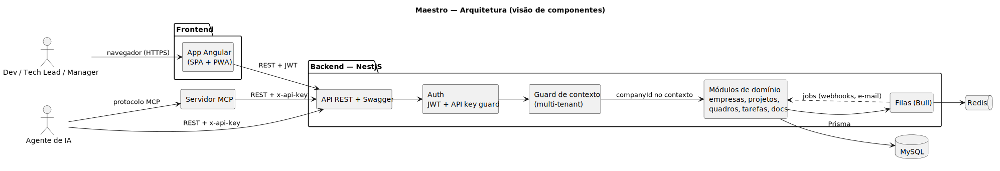
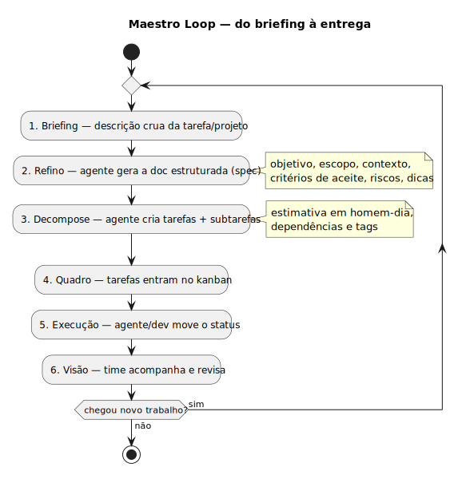
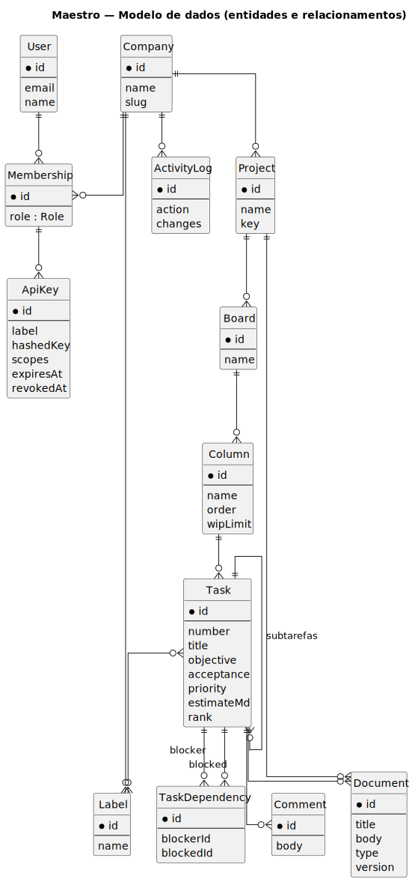
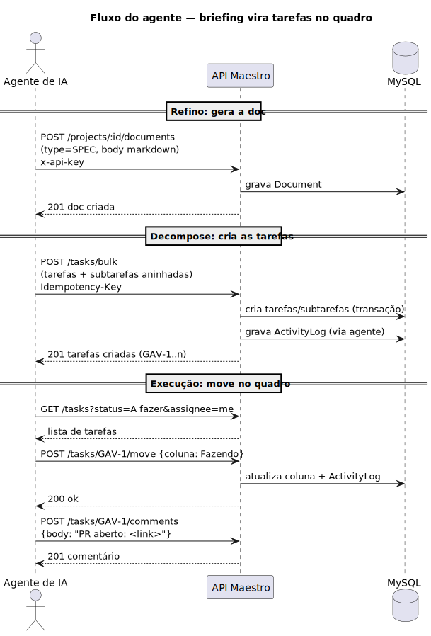
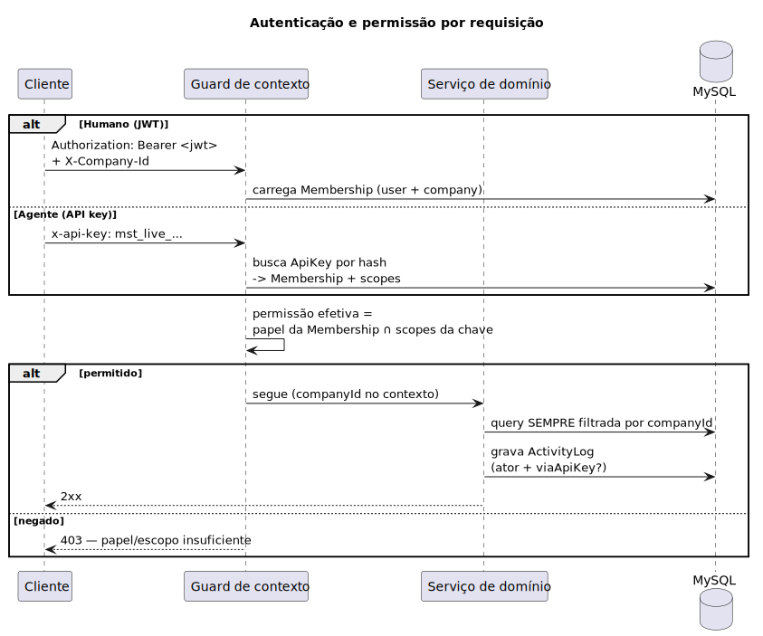
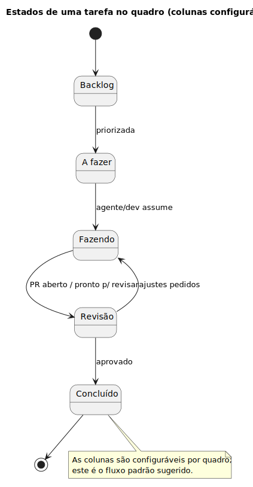

# Diagramas

Fluxogramas do Maestro em **PlantUML** (`.puml` — fonte) + **SVG** (renderizado).
Sempre que editar um `.puml`, regenere os SVGs:

```bash
./gerar.sh        # baixa o plantuml.jar (1x) e gera todos os .svg
```

Requisitos: Java + Graphviz (`dot`). O jar fica em `.plantuml.jar` (ignorado no git).

---

## 1. Arquitetura (componentes)

Visão geral: frontend Angular, backend NestJS (auth, contexto multi-tenant, domínio,
filas), servidor MCP, MySQL e Redis — e como humanos e agentes entram.



Fonte: [`arquitetura.puml`](arquitetura.puml)

## 2. Maestro Loop (fluxo principal)

O ciclo do produto: briefing → refino → decompose → quadro → execução → visão.



Fonte: [`maestro-loop.puml`](maestro-loop.puml)

## 3. Modelo de dados (ER)

Entidades e relacionamentos (detalhe em [`../02-modelo-de-dados.md`](../02-modelo-de-dados.md)).



Fonte: [`modelo-dados.puml`](modelo-dados.puml)

## 4. Fluxo do agente (sequência)

Como o agente transforma um briefing em doc + tarefas no quadro, via API key.



Fonte: [`fluxo-agente.puml`](fluxo-agente.puml)

## 5. Autenticação e RBAC (sequência)

Resolução de contexto (JWT vs. API key) e permissão efetiva = papel ∩ escopos.



Fonte: [`auth-rbac.puml`](auth-rbac.puml)

## 6. Estados da tarefa (kanban)

Transições padrão de uma tarefa entre as colunas do quadro.



Fonte: [`kanban-estados.puml`](kanban-estados.puml)

## 7. Fluxo de uma tarefa (objetivo → subtarefas → aceite)

Exemplo do fluxograma que a plataforma exibe por tarefa: a entrada (objetivo), os
passos (subtarefas com dependências, coloridos por status) e o ponto de aceite.
Conceito e renderização in-app em [`../08-fluxo-de-tarefas.md`](../08-fluxo-de-tarefas.md).


Fonte: [`fluxo-tarefa-exemplo.puml`](fluxo-tarefa-exemplo.puml)
